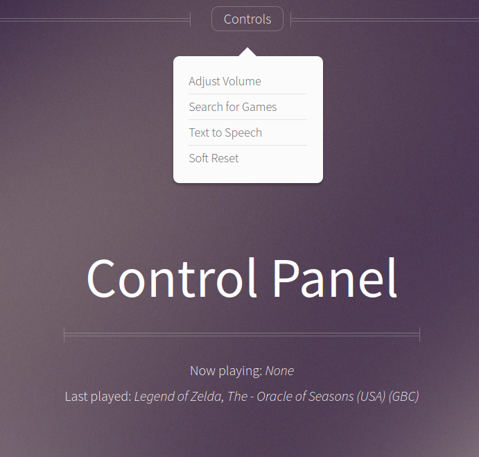

# RetroPie-WebPanel
A Simple PHP Control Panel for RetroPie

## Warning
This relies heavily on **shell_exec()** commands, and is for that reason insecure. This web panel should **never** be public-internet-facing.

## Photo

## Features
A plain web panel (/panel.php) which:
 - displays "Now Playing" and "Last Played" games
 - has a "volume control" slider, which displays the current volume level (on the HDMI device) and allows you to adjust volume remotely
 - has a "search" feature, to search for ROMs on the system & launch them remotely from this web panel (i.e., start the game up from your phone)
 - has a field for text-to-speech (really just for fun, serves no purpose)
 - has a "soft reset" button to exit any currently playing games and load the main emulationstation menu

## Requirements
 - Nginx or Apache, with PHP >= 7.2
 - espeak (For text-to-speech)
 - aplay (For text-to-speech)
 - amixer (For volume control)

As is indicated in /etc/sudoers, www-data must be given permissions to execute commands as the pi user without password verification, in order to perform soft resets or to launch games. As is indicated in /etc/group, www-data has also been added to the "audio" group for TTS, though that command could also be run as a *sudo -u pi* if you like.

## Background
I had to replace my laptop screen and didn't want to throw away the old one which still mainly worked (I absolutely hate waste), so I bought a $10 Raspberry Pi Zero W, threw RetroPie on it and made it (with the laptop display) into a video-game-playing end-table for my family (I don't even play video games). I made this web control panel to make the system easier for them to use, so that they can partially control it from their phones etc.

